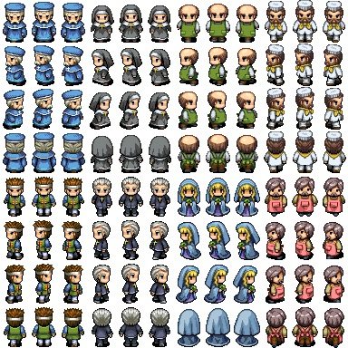
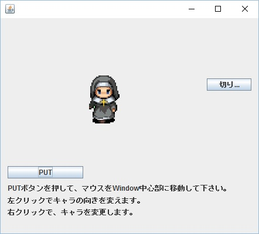
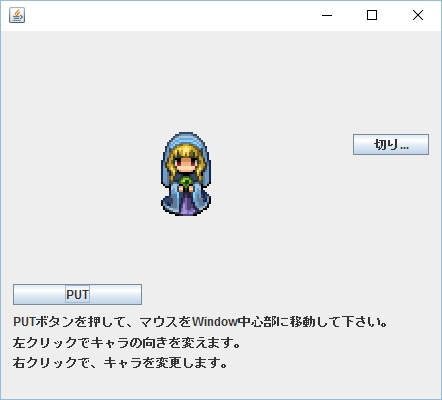
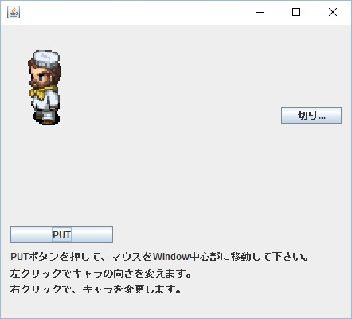
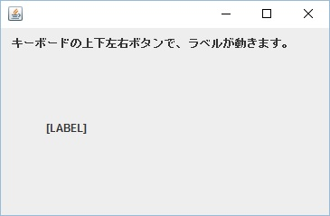
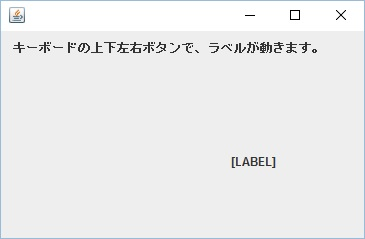
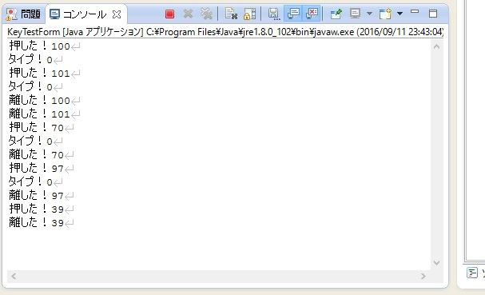
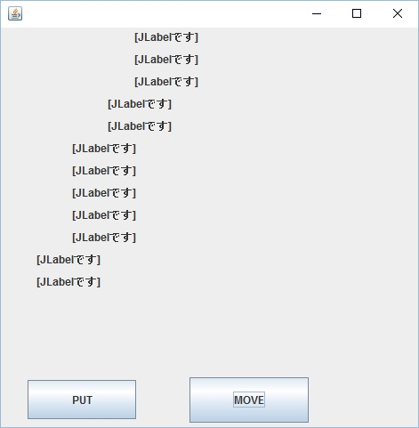

# work_JavaSwing
Ｊａｖａ Swingフレームワークを使った、Windowsアプリのサンプルです。Swingは、Androidと構造がとても良く似ているので、UI開発前に学習すると良いかもです。  

# 環境
・Eclipse 4.2 Juno  
・Swing Designer（Eclipseプラグイン）  
・Java

Swingを使う為に、Eclipseにソフトウェアを追加インストールして下さい。
＃Swing環境の作り方は、ドキュメントに纏め、リポジトリに入れてています。
＃（【飛峪】Javaウィンドウズアプリ(eclipse_Swing)_環境設定手順書.doc)

# サンプル紹介
Eclipseのプロジェクトを数本入れています。インポートしてお使い下さい。  

**SwingProject**  
２Ｄキャラのデータは、だいたい以下の様な「１枚もの」の画像データに収められています。  
  
このサンプルは、画像データから１人分を切り出し、キャラクターとして歩かせる（アニメーションさせる）プログラムです。  

キャラその１  
  
キャラその２  
  
キャラその３  
  
こんな感じです。  
マウスをぐりぐり動かして、歩かせて楽しみましょう。（この画像は、無料素材を使用しています。）  

300msタイマーで歩かせるアニメーション処理を入れています。マウスのボタンで、キャラの向き変更、キャラの種類変更が行えます。本プログラム実行時は、「SwingTest01.java」を起動して下さい。
他にも、「ThreadTest.java」を起動すると、スレッド起動実験が出来たり、
「SwingTest02.java」を起動すると、タイマーテストが出来たりします。  

**SwingKeyTest**  
マウスでは無く、キーボードからのイベントを受け付けるテストです。  
カーソルキーを押すと、  
  
　　↓  
  
こんな風に、[LABEL]というラベルが移動します。（お好みで、好きな画像に差し替えて下さい。）  

また、ログ出力で、キーボードのキーコードを調べる事も出来ます。
  
これで、好きなキー入力処理を記述できます。  
詳しくは、「KeyListenerCls.java」を確認して下さい。  

**SwingDesiignTestProject**  
今iが1つ多い事に気が付きました（恥）  
ArrayList（）の動作確認プログラムです。「PUT」ボタンを押すとラベルが増えて、「MOVE」ボタンを押すと、全てのラベルが一斉に右に移動します。  
  
動的に生成するラベルをArrayList()に追加し、移動させる際はリスト内の全ラベルに対して座標変更を行っています。  
動的配列にクラス・インスタンスを格納する例として見て下さい。  

# 続く。
過去、会社同僚たちとの勉強会は１００回を超え、色々なプログラムを作ってきました。  
逐次整理し、アップしていきたいと思います。  
(2016/9)
